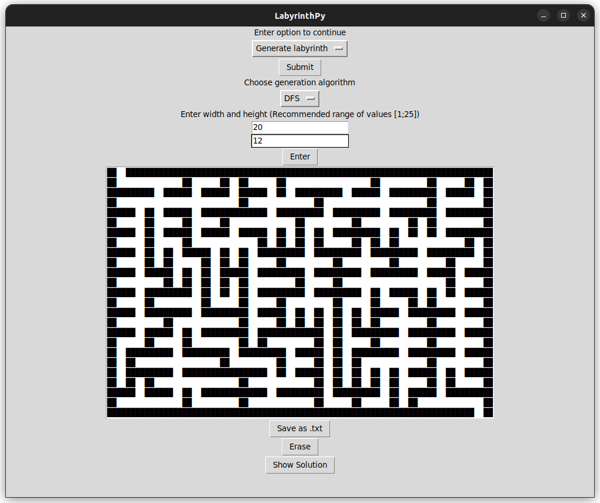
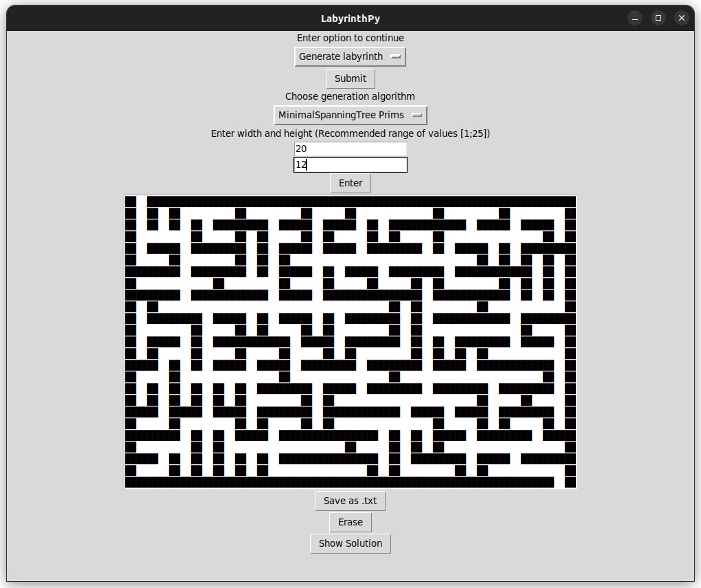
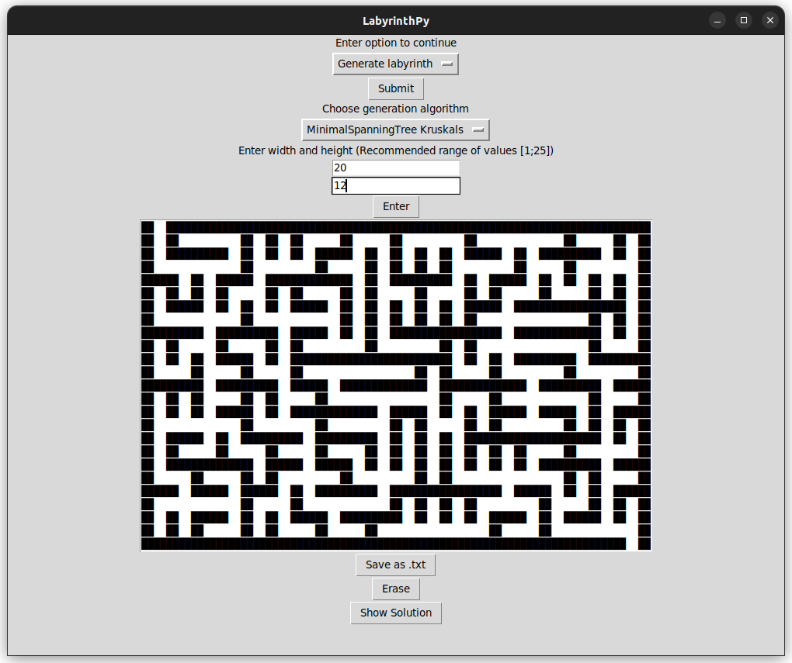
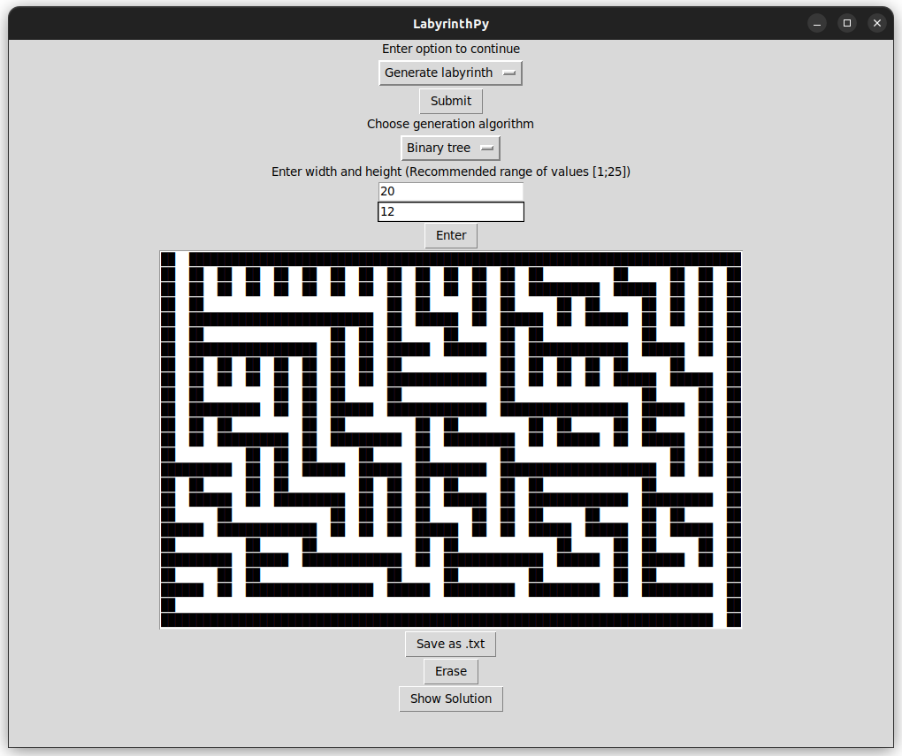
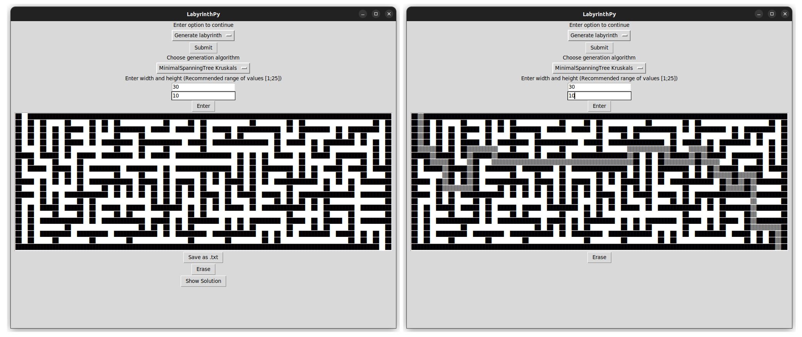
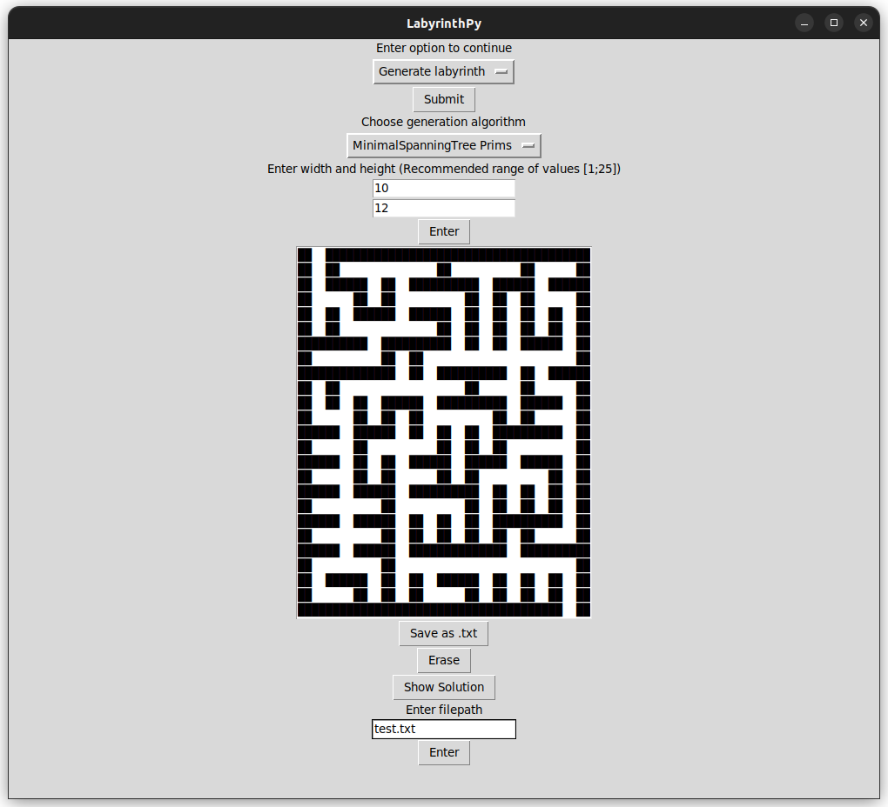
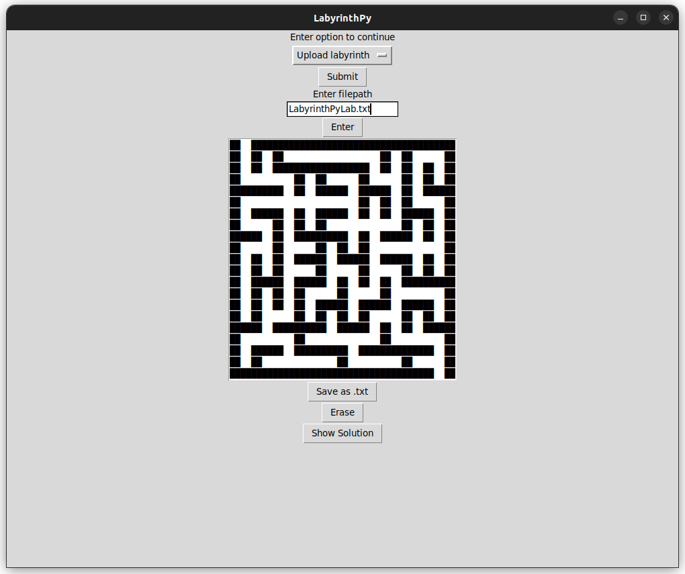

# LabyrinthPy

Это приложение позволяет генерировать лабиринты в виде последовательности ASCII символов с помощью нескольких алгоритмов с указанным размером, сохранять их в указанную директорию,
загружать уже созданные лабиринты из указанной директории, а также решать их и выводить визуализацию пути решения

</blockquote>
</blockquote>
<h1 id="-arncpp">Запуск LabyrinthPy</h1>

Запуск приложения через консоль:

<code>gitclone https://github.com/tenebrissilvam/LabyrinthPy.git</code>

<code>cd ./LabyrinthPy</code>

<code>python main.py</code>

<h1 id="-">Генерация лабиринтов</h1>
Для генерации лабиринта в верхнем меню выберите опцию Generate Labyrinth и в ниже появляющихся ячейках укажите ширину и высоту лабиринта.
Рекомендуемые размеры для генерации: такие, чтобы лабиринт помещался на экране. Для генерации нового лабиринта нажмите кнопку Erase, которая очистит рабочее поле и выберите
алгоритм генерации и размеры заново

<h3 id="-">DFS. Поиск в глубину</h3>
Для этого выберите опцию генерации DFS

<h3 id="-">MST Prims. Остовное дерево, алгоритм Прима</h3>
Для этого выберите опцию генерации MinimalSpanningTree Prims

<h3 id="-">MST Kruscals. Остовное дерево, алгоритм Крускала</h3>
Для этого выберите опцию генерации MinimalSpanningTree Kruscals

<h3 id="-">Binary tree. Бинарное/двоичное дерево</h3>
Для этого выберите опцию генерации Binary tree

<h1 id="-">Решение лабиринтов</h1>
Для каждого сгенерированного или загруженного из файла лабиринта можно вывести решение с помощью кнопки Show Solution

<h1 id="-">Сохранение лабиринтов</h1>
Любой сгенерированный лабиринт можно сохранить в формате txt как набор ASCII символов. Для этого нажмите кнопку Save as .txt и напишите в появляющейся ячейке путь к файлу,в который будет сохранен лабиринт.
Можно не вводить путь к файлу, тогда лабиринт сохранится в файл LabyrinthPyLab.txt на одном уровне с main.py

<h1 id="-">Загрузка лабиринтов</h1>
Для загрузки лабиринта из файла выберите в верхнем меню опцию Upload Labyrinth, а затем укажите путь к файлу в появляющейся ячейке. Распознанный из файла лабиринт
будет выведен в окно приложения и для него появится возможность показать решение.

</blockquote>
